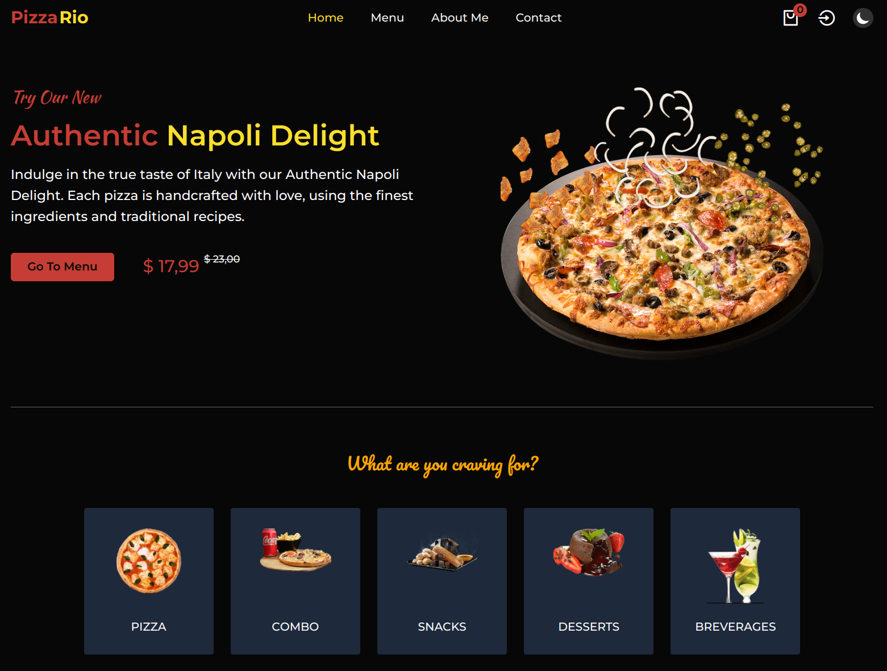
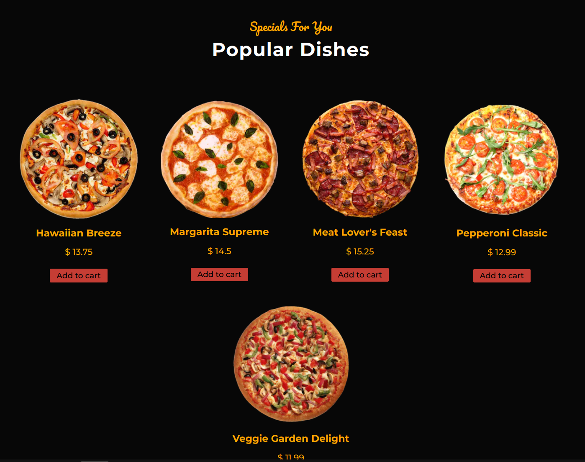
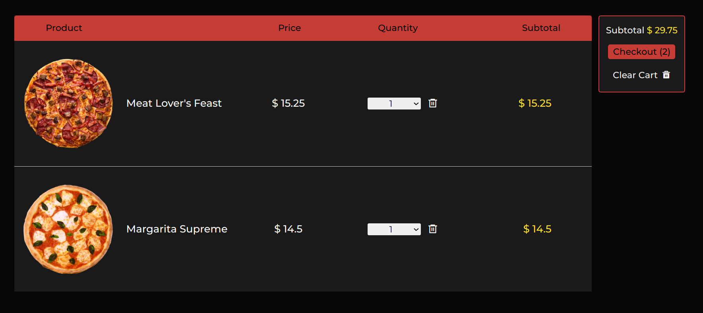

# PizzaRio - Pizza Delivery App
Welcome to the PizzaRio! This app is built using Prisma and Next.js.

## Features
- **Login with Google: Users can log in with their Google accounts, making the sign-in process smooth and secure.**
- **Cart Functionality: Users can add items to their cart even before signing in. Once signed in, the local cart and the database cart will be merged during checkout.**
- **Responsive Design: The app is designed to provide an optimal user experience across various devices and screen sizes.**
- **Metadata: The app is optimized for search engines with metadata to ensure better visibility in search results.**

## Take a Look





## Dependencies
- **[Next.js](https://nextjs.org/) - Frontend**
- **[Prisma](https://www.prisma.io/) - DB Operations**
- **[NextAuth.js](https://next-auth.js.org/) - Authentication**
- **[Zod](https://zod.dev/) - Validation**

## Work To Be Done
- **Payment gateway integration**

## Installation
Set up environment variables in a .env.local file.
```
git clone https://github.com/yourusername/pizza-delivery-app.git
npm install
npm run dev
```
